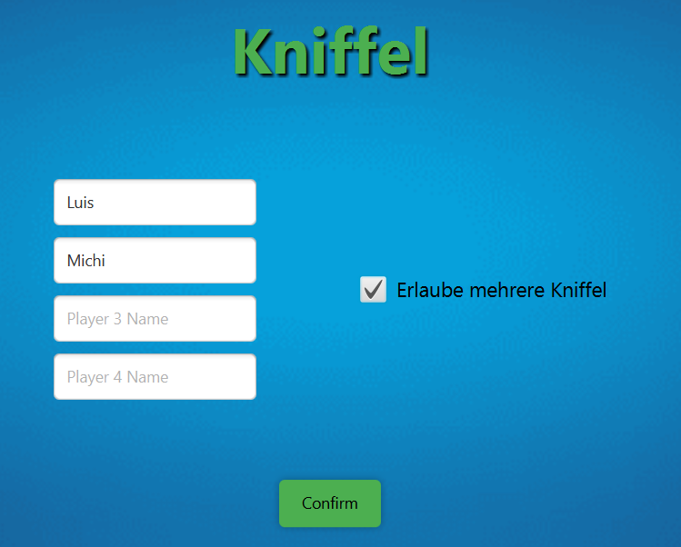
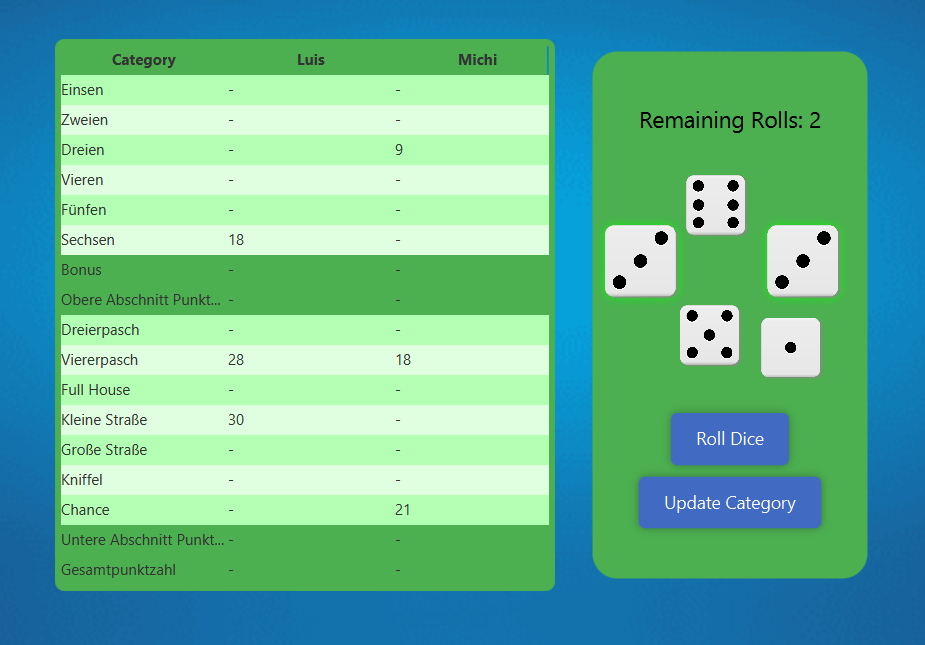

# Kniffel - Digital Dice Game (Educational Project)
[](https://coveralls.io/github/luiszink/Kniffel?branch=develope)
[](https://github.com/luiszink/Kniffel/actions)


Welcome to Kniffel - the digital adaptation of the classic dice game! This project, developed as part of a Software Engineering course, brings the excitement and strategy of Kniffel to your computer screen.

## Features
### Not yet implemented
1. **Highscore Table:** Compare your scores with friends and see who ranks highest.
2. **Customizable Color Layouts:** Personalize the game with different color themes to suit your style.

## Installation

To install and run Kniffel, ensure you have the following prerequisites:

1. **Java Development Kit (JDK):** Make sure you have JDK 1.8 or higher installed. You can check your version by running `javac -version` in the command line.
2. **sbt (Scala Build Tool):** Install sbt from the [official website](https://www.scala-sbt.org/download.html) depending on your operating system:
   - **Mac:** Follow the instructions [here](https://www.scala-sbt.org/1.x/docs/Installing-sbt-on-Mac.html).
   - **Windows:** Follow the instructions [here](https://www.scala-sbt.org/1.x/docs/Installing-sbt-on-Windows.html).
   - **Linux:** Follow the instructions [here](https://www.scala-sbt.org/1.x/docs/Installing-sbt-on-Linux.html).

### Steps to Run the Project

1. Clone the repository:
    ```bash
    git clone https://github.com/luiszink/Kniffel.git
    cd kniffel
    ```
2. Start sbt in the project root directory:
    ```bash
    sbt
    ```
3. Compile the project:
    ```bash
    sbt compile
    ```
4. Run the project:
    ```bash
    sbt run
    ```

## How to Play

Kniffel is a dice game where the objective is to score the highest points by rolling five dice to make certain combinations. 

1. **Setup:** Enter the names of the players.

    

2. **Rolling:** Each player gets up to three rolls per turn to make their best combination.
3. **Scoring:** Points are awarded based on the combinations made, with specific values for each combination (e.g., Full House, Four of a Kind, etc.).

    

4. **Winning:** The player with the highest score at the end of all rounds wins the game.

## Contribution
**Note:** Currently, we are not accepting contributions as the project is still under development for educational purposes at HTWG Konstanz.

## Contact
For questions, feedback, or support, please contact us at [your.email@htwg-konstanz.de](mailto:your.email@htwg-konstanz.de).

Enjoy the game! 🎲🏆